## Prerequisites

To complete this tutorial, you will need an [IBM Cloud account](https://cloud.ibm.com/registration?cm_sp=ibmdev-_-developer-tutorials-_-cloudreg). You can obtain a free trial account, which gives you access to [IBM Cloud](https://cloud.ibm.com?cm_sp=ibmdev-_-developer-tutorials-_-cloudreg), [IBM Watson Studio](https://www.ibm.com/cloud/watson-studio), and the [IBM Watson Machine Learning Service](https://www.ibm.com/cloud/machine-learning).

## Steps

1. [Launch Watson Studio](#launch-watson-studio)
1. [Projects](#projects)
1. [Watson Machine Learning](#watson-machine-learning)
1. [Deployment spaces](#deployment-spaces)
1. [Watson Machine Learning API Key](#watson-machine-learning-api-key)
1. [Project Assets](#project-assets)
1. [Jupyter Notebooks](#jupyter-notebooks)

### Launch Watson Studio

Launch [Watson Studio](https://dataplatform.cloud.ibm.com/), select an appropriate region, and then enter the username name associated with your IBM Cloud account.

  

**NOTE**: You may notice that the "IBM Watson Studio" banner will in some cases be replaced with the name "IBM Cloud Pak for Data". The banned used is dependent on the number and types of services you have created on your IBM Cloud account. The change will have no effect on how the service functions or is navigated.

### Projects

In Watson Studio, we use the concept of a project to collect and organize the resources used to achieve a particular goal (resources to build a solution to a problem). Your project resources can include data, collaborators, and analytic assets like notebooks and models, etc.

To create a new project, you can either:

* Click **Create a project** from the Watson Studio home page

  

* Or, click on **Projects** -> **View all projects** in the left-side navigation menu (☰), then click **New project +*

  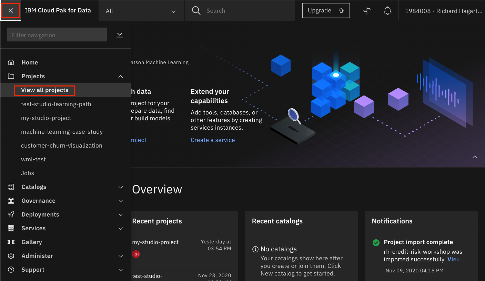

On the create project panel, you can either create an empty project, or import a file that contains project assets.

  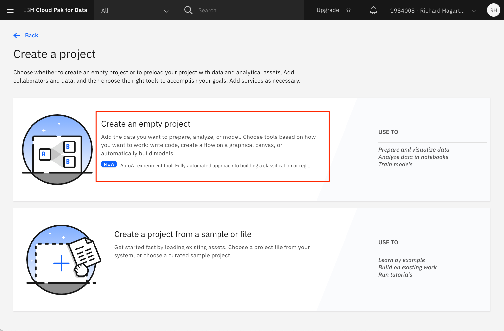

When creating a new project, you will need to provide a unique project name, and an object storage instance. If you haven't already create a Cloud Object Storage instance in your IBM Cloud account, you can create one now by clicking Add.

**NOTE**: If you have created one Cloud Object Storage instance in your IBM Cloud Account, that instance will automatically be assigned to your project. If you have multiple instances, you will need to select which one to use.

In this example, we will click the **Add** button to create a new Cloud Object Storage instance.

  

A new tab will open up, where you can create the Cloud Object Service. By default, a Lite (Free) plan will be selected. Scroll down and update the name of your Cloud Object Storage service if you wish, and click **Create**.

  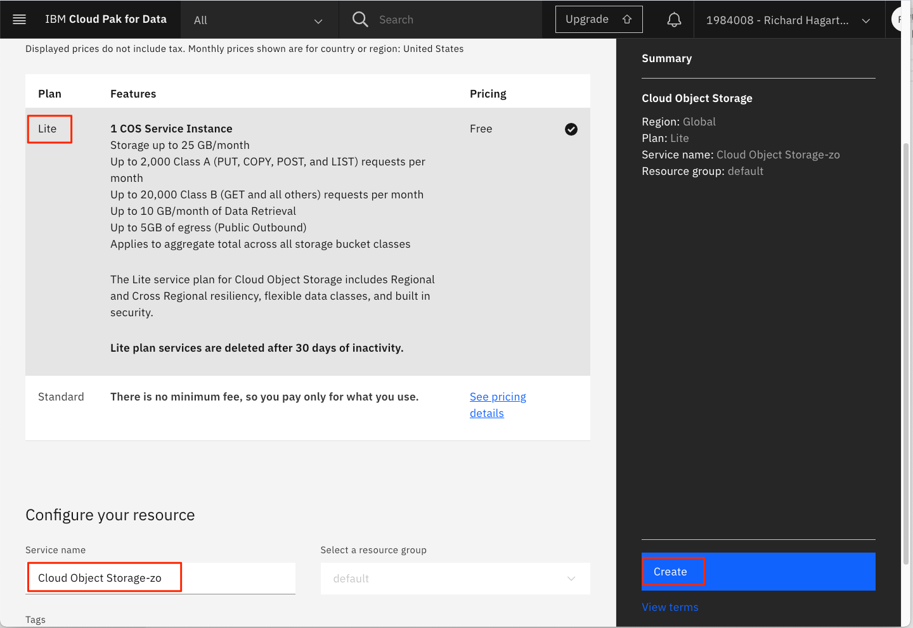

The browser tab will automatically close when the Cloud Object Storage instance has been created. Back on Watson Studio project page, click **Refresh**.

  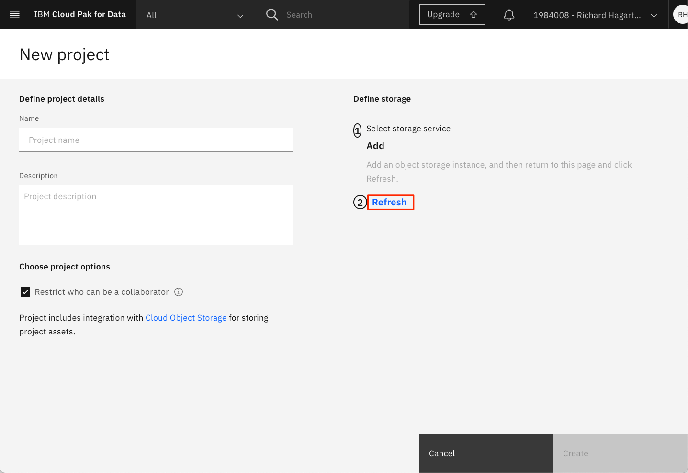

The newly created Cloud Object Storage instance will now be displayed under **Storage**. Enter a unique project name and click **Create** to finish creating the project.

  

Once created, the project **Overview** page will be displayed.

  

### Watson Machine Learning

If you wish to run any Machine Learning experiments, you will need to associate a Watson Machine Learning service instance to your project.

Go to the **Settings** tab of your project and look for the **Associated services** section. Click on the **Add service** action menu and click on **Watson**.

  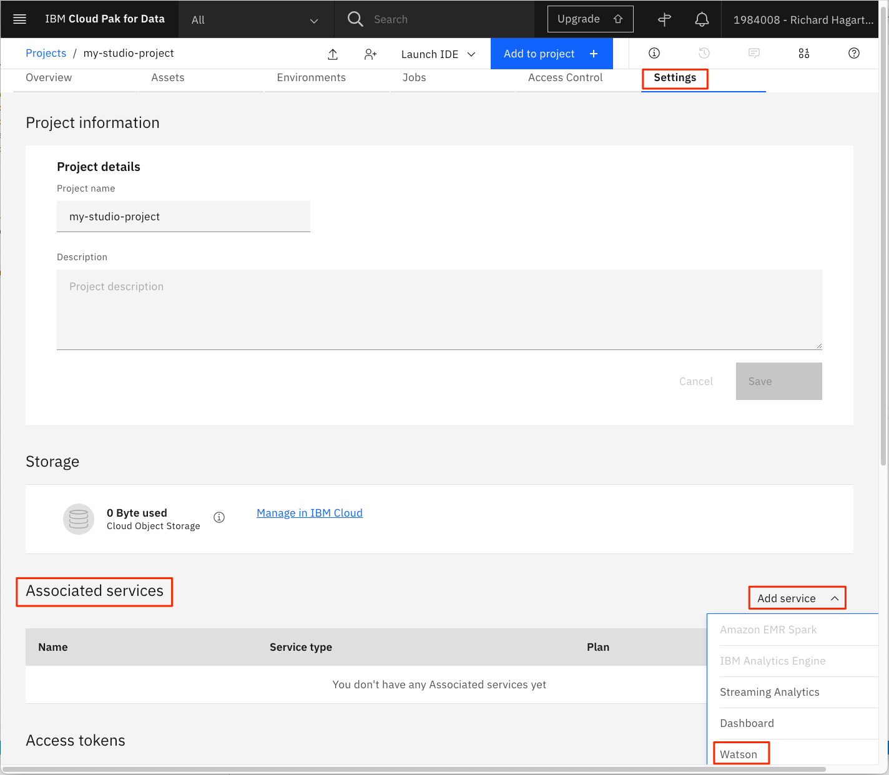

You will be presented with a list of Watson services that you have provisioned on your IBM Cloud account.

  

If you do not have a Watson Machine Learning service provisioned, or you would like to create a new one, you can do so by clicking the **New service +** button.

  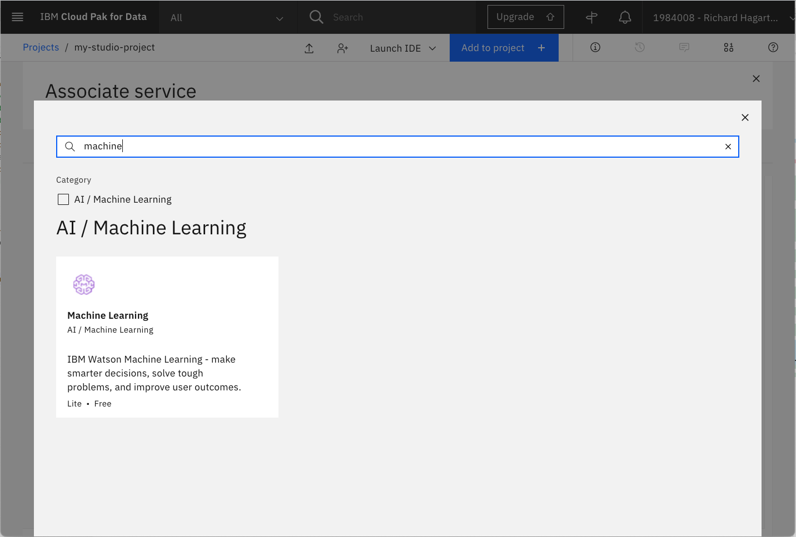

This will then be presented with a list of all available Watson services that can be provisioned from your IBM Cloud account. You can use the search bar to filter the choices.

  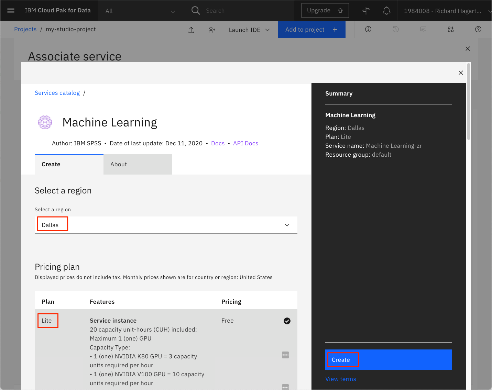

Click the **Machine Learning** tile to provision your machine learning service.

From the **Machine Learning** creation panel, choose the appropriate **Region** and select the **Lite** plan.

**Note**: Make sure you select the same region where your IBM Watson Studio instance is provisioned.

  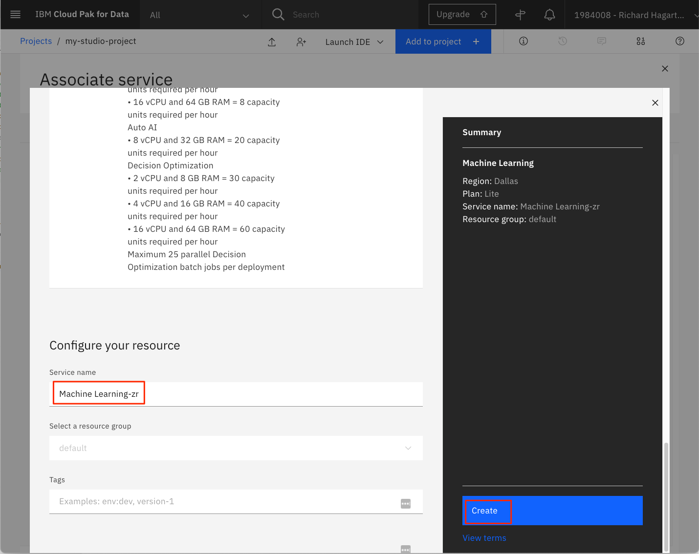

Use the default **Service Name** or enter a unique name, then click **Create**.

  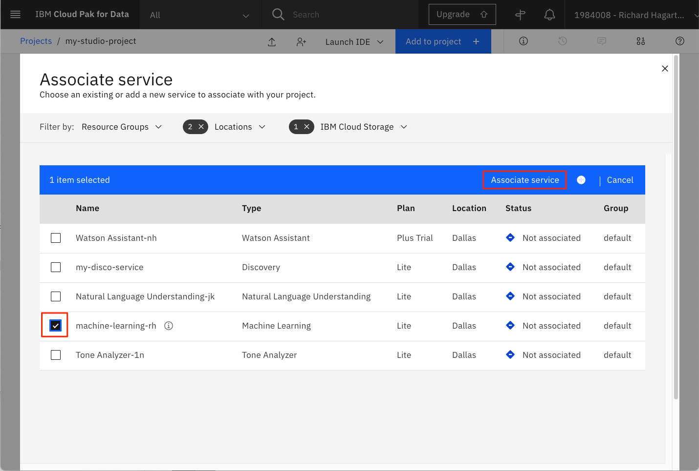

To associate the service with the project, click the checkbox next to the Watson Machine Learning service instance, then click **Associate service**.

**Note**: If you have multiple Machine Learning services, make sure you select the one that is in the same region as is your IBM Watson Studio service.

Once complete, the machine learning service will be listed in the **Associated Services** section of the project **Overview** panel.

  

### Deployment spaces

IBM Watson Studio uses the concept of **Deployment Spaces** to configure and manage the deployment of a set of related deployable assets. These assets can be data files, machine learning models, etc. To create one, go the (☰) navigation menu, expand **Deployment spaces** and then select **View all spaces**.

  

Click the **New deployment space +** button.

  

Give your deployment space a unique name and optional description. Provide the **Cloud Object Storage** and **Machine Learning** service instances that you have created in earlier steps. Then click the **Create** button.

  

Once the deployment space is created, click the **View new space** button.

  

This is the new deployment space **Assets** panel:

  

### Watson Machine Learning API Key

If you need to execute Jupyter notebooks which use the Watson Machine Learning API, you will need to provide an **API key** from your IBM Cloud account, as well as the location code of the Watson Machine learning service instance.

To create an **API key** you must use the **IBM Cloud** console. From the main dashboard, click the **Manage** menu option, and select **Access (IAM)**.

  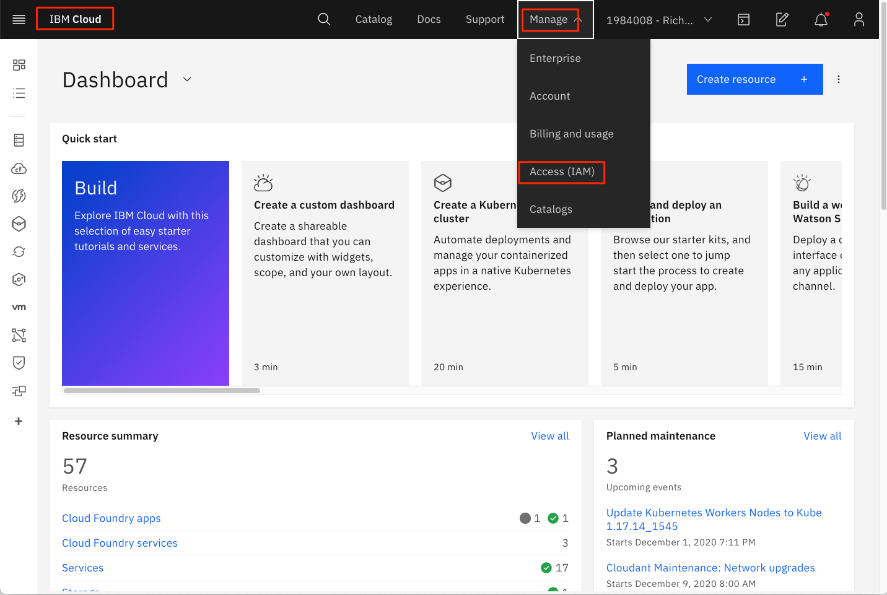

Select the **API keys** menu option to view the list of existing keys.

  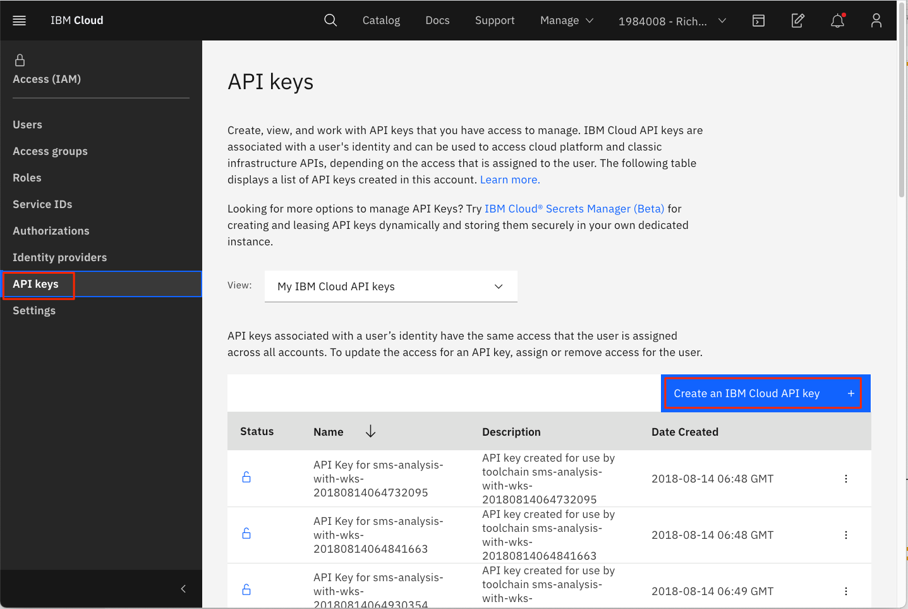

Click **Create an IBM Cloud API key +**. 

  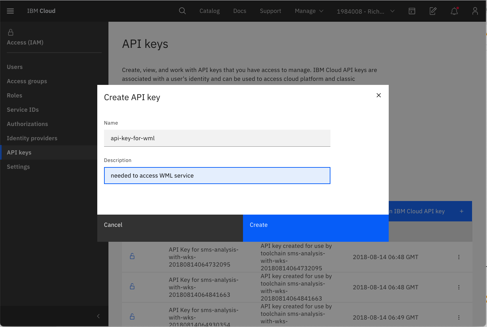

Click **Create an IBM Cloud API key**. Enter a name for your key, and then click **Create**.

  

Copy or download the API key because it will be required if you use the Watsom Machine Learning API in your notebook.

>**IMPORTANT**: The generated API Key is temporary and will disappear after a few minutes, so it is important to copy and save the value for when you need to import it into your notebook.

You also must determine the location of your Watson Machine Learning service. One way to determine this is to click on your service from the resource list in the IBM Cloud dashboard. From the **Manage**, click **Details**.

In this case, the service is located in Dallas, which equates to the us-south region code.

**NOTE**: Region codes include: au-syd, in-che, jp-osa, jp-tok, kr-seo, eu-de, eu-gb, ca-tor, us-south, us-east, and br-sao.

### Project Assets

There are multiple ways to add assets to your project. Start by clicking on the **Assets* tab of your project.

If you click on the **Add to project +** button, you will get a list of the available assets.

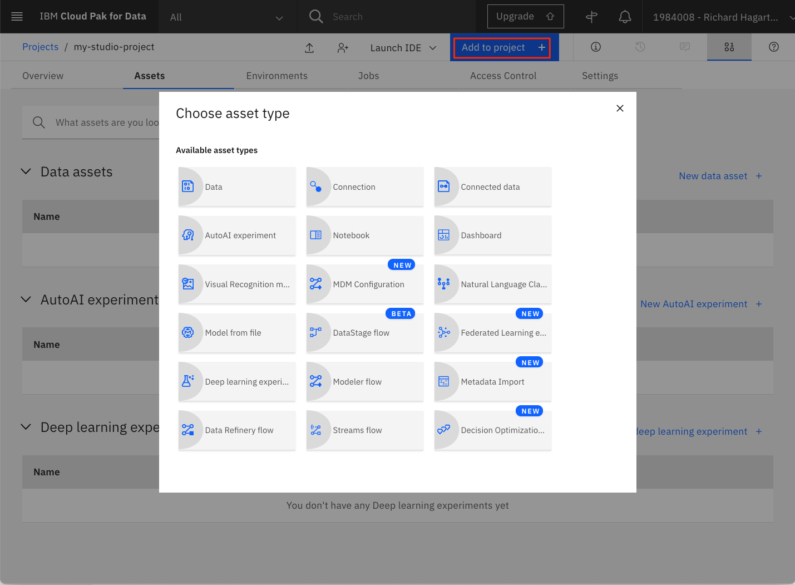

You can also go to the specific assets sections and click the corresponding **New ...** button.

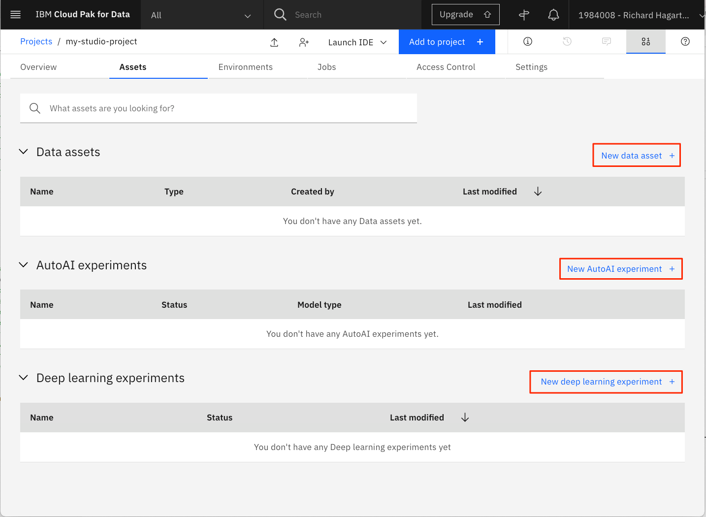

For data files, you can click the **0110** button, click the **Load** tab, and then drag and drop files, or click **browse** to select local files.

### Jupyter Notebooks

#### Add notebook to project

To create a Jupyter Notebook in your project, click the **Notebook** option in the list of avaliable asset types.

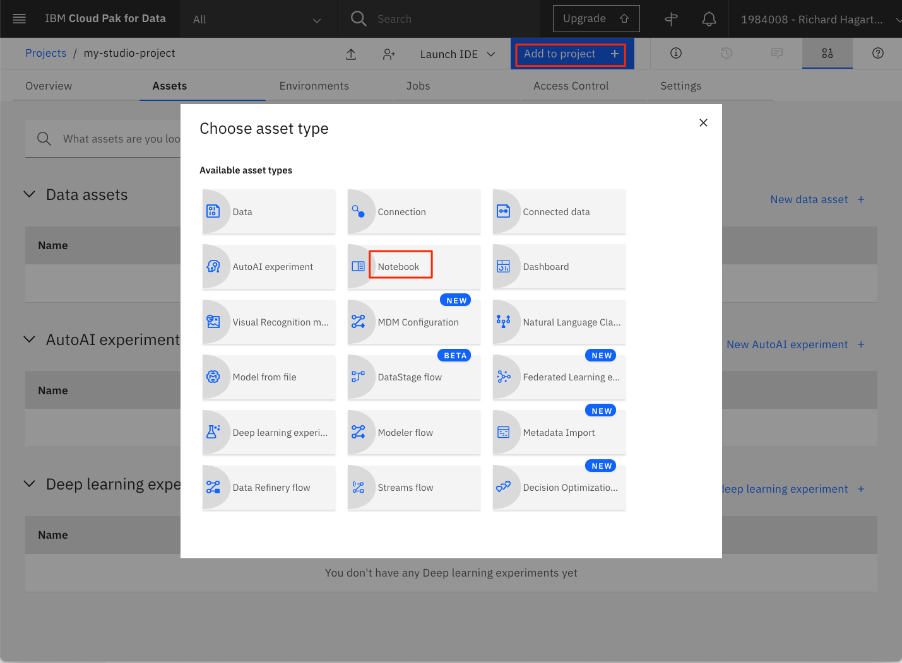

To upload a notebook from a URL, click the **URL** tab.

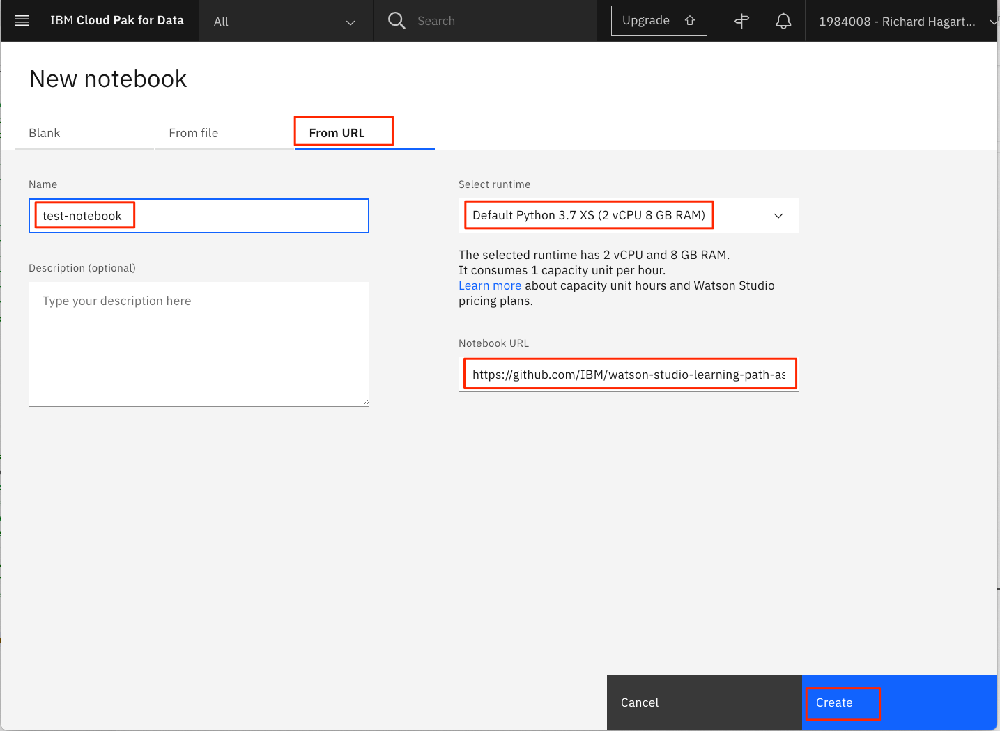

To add the notebook:

1. Enter a unique notebook name
2. Select the appropriate Python run-time version
3. Enter the URL that points to your notebook
4. Click the **Create** button

This will initiate the loading and running of the notebook within IBM Watson Studio.

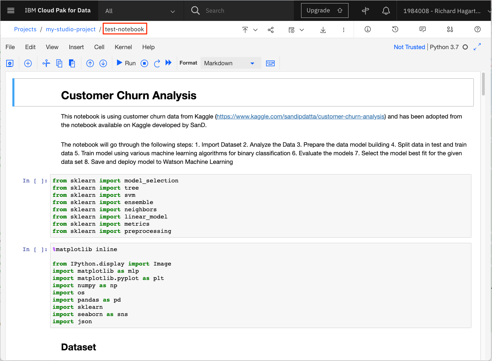

After exiting the notebook session, you can re-start the notebook by clicking the **pencil** icon located next to the notebook in the asset list.

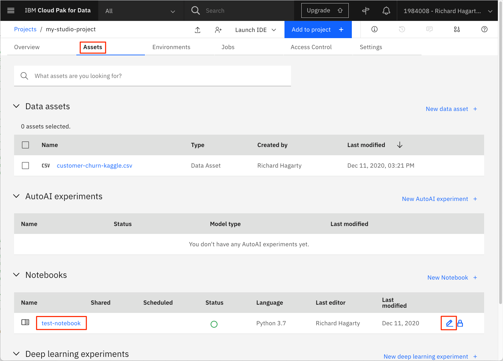

#### Running a notebook

When a notebook is run, each code cell in the notebook is executed, in order, from top to bottom.

Each code cell is selectable and is preceded by a tag in the left margin. The tag format is `In [x]:`. Depending on the state of the notebook, the `x` can be:

* A blank, which indicates that the cell has never been run
* A number, which represents the relative order that this code step was run
* An `*`, which indicates that the cell is running

There are several ways to run the code cells in your notebook:

* One cell at a time. Select the cell, and then press **Play** in the toolbar.
* Batch mode, in sequential order. From the **Cell** menu, there are several options available. For example, you can `Run All` cells in your notebook, or you can `Run All Below`, which starts running from the first cell under the currently selected cell, and then continues running all of the cells that follow.
* At a scheduled time. Press the **Schedule** button that is located in the upper-right section of your notebook page. Here, you can schedule your notebook to be run once at some future time or repeatedly at your specified interval.

To insert data into your notebook:

1. Click the notebook cell and place the cursor
1. Click the data **0100** icon
1. Click the **Files** tab
1. Select the data asset you want to insert, then select the appropriate insert option

This will result in code being inserted into the cell.

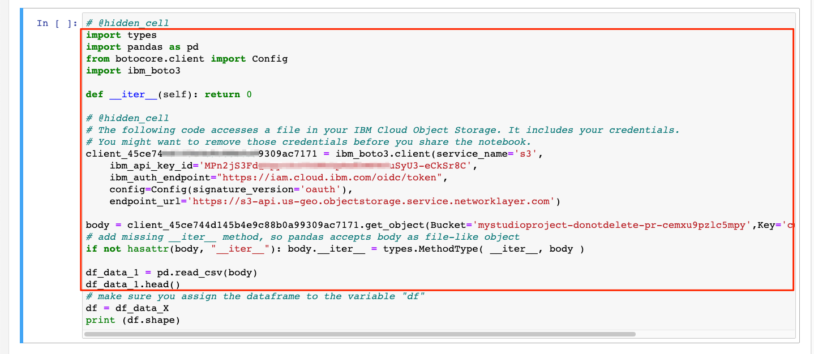
